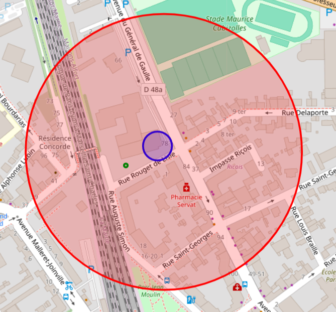
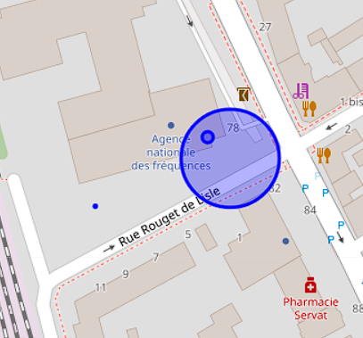
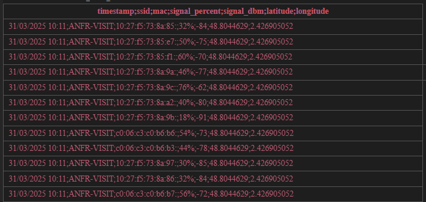

# Défi WiFi Hackathon
The project developed during a hackathon aimed at locating WiFi access points in real time using:
- Network sniffing,
- Distance estimation based on signal strength,
- Map visualization in a Flutter application, and finding the exact points
### 1. Working on the dataset
The original Dataset we were given was of the following format, we used the MAC address as a unique identifier of the network.
**Issues:**
- Frequently in the dataset, the same mac address at the same longitude and latitude, emits two signals, with different percentages, resulting in different distances, sometimes resulting in a difference of 10-100m
```json
{
  "SSID": "Freebox-D4E",
  "BSSID": "58:ef:68:cd:d4:ef",
  "signal_dBm": -61,
  "signal_percent": 57,
  "latitude": 48.8566,
  "longitude": 2.3522,
  "timestamp": "2025-04-06T14:34:21"
}
```

Here's, how we looked into retrieving the distance
we used the FSPL (Free Space Path Loss) model :
where :
- 𝑃em ≈ 23dBm
- 𝑃rec : signal mesuré (ex: -65 dBm)
- f=2400 MHz (WiFi 2.4 GHz)
- $d=10^{(Pem − Prec​ + 27.55−20⋅log(10))/20}$

#### How this looks in Python
In theory this worked in python,
Initially, we got huge difference in the radius/distance of the device from the hosts, that were really bizarre, resulting in the following:



The hotspot should be located in the intersection of the circles, as given by the distance, we thought about adding a meter margin to account for attenuation, but this was way to much, after tweaking the formula, and renormalizing the signal strength, as we figured the dataset, had issues, we finally ended up with the following:


**Notice**: 
- As discussed, it has to be on the intersection of the circles, but we can at some point remove other circles, and associate it to noise in the dataset.
- As well as removing noise, there isn't a clear intersection, in this case, we give a margin to the circles distance, and find the intersection, as this could be the result of minus obstructions, or loss due to noise as we are converting from percentage to dBm to meters.
### 2. How will we sniff the data on laptops, and androids(IOS not fully compatible)


Here's what we were given for the Hackathon.

And here is the result after sniffing using a python script (you can find the scripts in previous commits if you want)


#### Using rust, C and dart:ffi
 **NDK with JNI/FFI**
- Use the `pcap` crate inside a Rust library.
- Build that Rust lib for Android using `cargo-ndk` or manually with `cargo build --target aarch64-linux-android`.
- Expose a simple C-compatible API using `#[no_mangle] extern "C"` to communicate with Android Java/Kotlin or Flutter (via FFI).
For instance:

```rust
#[no_mangle]
pub extern "C" fn start_scan() {
    std::thread::spawn(|| {
        let mut cap = pcap::Capture::from_device("wlan0").unwrap().open().unwrap();
        while let Ok(packet) = cap.next() {
            println!("Sniffed {:?}", packet);
        }
    });
}
```

**Installation:**
Install `cargo-ndk` (if not already):
``` bash
cargo install cargo-ndk
```

Then build for Android targets:
```bash
cargo ndk -t arm64-v8a -o ../android/app/src/main/jniLibs build --release
```

This will place a `.so` file in: `android/app/src/main/jniLibs/arm64-v8a/librust_backend.so`
